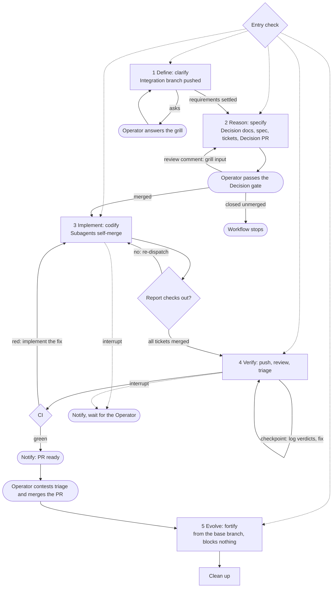

# Workflow diagram

The five phases, the Entry check that picks the first unmet one, and the interrupts.

```mermaid
flowchart TD
  E{Entry check} -.-> D
  E -.-> R
  E -.-> I
  E -.-> V
  E -.-> F
  D["1 Define: clarify<br/>Integration branch pushed"] -->|asks| S1([Operator answers the grill])
  S1 --> D
  D -->|requirements settled| R["2 Reason: specify<br/>Decision docs, spec, tickets, Decision PR"]
  R --> G([Operator passes the Decision gate])
  G -->|review comment: grill input| R
  G -->|merged| I["3 Implement: codify<br/>Subagents self-merge"]
  G -->|closed unmerged| X0([Workflow stops])
  I --> C{Report checks out?}
  C -->|no: re-dispatch| I
  C -->|all tickets merged| V["4 Verify: push, review, triage"]
  V -->|checkpoint: log verdicts, fix| V
  V --> CI{CI}
  CI -->|red: implement the fix| I
  CI -->|green| N([Notify: PR ready])
  N --> M([Operator contests triage and merges the PR])
  I -.->|interrupt| NI([Notify, wait for the Operator])
  V -.->|interrupt| NI
  M --> F["5 Evolve: fortify<br/>from the base branch, blocks nothing"]
  F --> X[Clean up]
```
